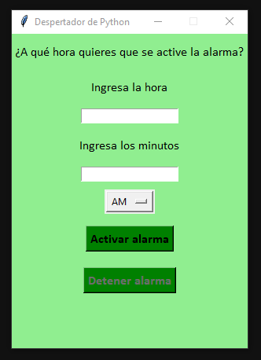
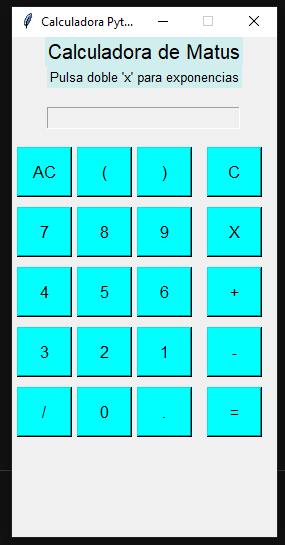
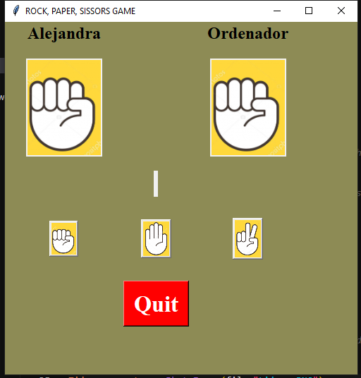
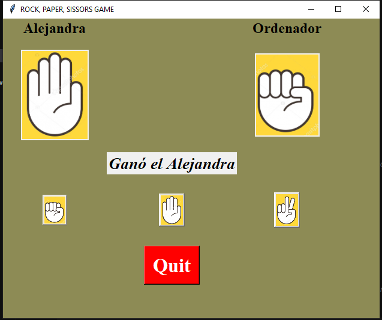

# 🐍 Proyectos Python - Prácticas de Clase

Este repositorio contiene una colección de ejercicios realizados en clase con Python. Son proyectos sencillos, con GUI o juegos simples, enfocados en aprender lógica, estructuras básicas y librerías como `tkinter`, `pygame` y `turtle`.

> ⚠️ **Nota personal:** Estos proyectos fueron realizados al principio del curso, cuando todavía no sabía estructurar bien los archivos ni carpetas. No están optimizados, pero sirven para demostrar que sé usar Python y construir programas funcionales.

---

## 📂 Índice de proyectos

---

### 🕰️ 01 - Despertador  
Aplicación con interfaz gráfica que te permite programar una alarma a una hora concreta. Reproduce sonido y muestra mensajes emergentes.

📸 Vista previa:  


---

### 🧮 02 - Calculadora  
Calculadora básica con GUI en `tkinter`. Permite realizar operaciones simples con una interfaz clara.

📸 Vista previa:  


---

### ✊✋✌️ 03 - Piedra, Papel o Tijera  
Juego clásico contra el ordenador, con imágenes y selección aleatoria. Usa `tkinter` y muestra el resultado visualmente.

📸 Vista previa menú:  


📸 Vista previa en partida:  


---

## 🧰 Tecnologías usadas

- Python 3  
- Tkinter  
- Pygame  
- Turtle (en algunos casos)

---

## ▶️ Cómo ejecutar los proyectos

1. Asegúrate de tener Python 3 instalado.
2. Si un proyecto necesita sonido:
   ```bash
   pip install pygame
